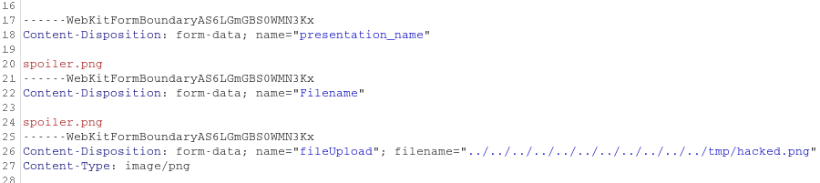

# File Write
BBB versions < 2.2.10 contain a bug when processing files for download.
It allows overwriting files with any of BBBs accepted extensions (e.g. txt,
png, pdf). This can potentially be used together with the [privilege escalation bug](PrivEsc.md).
An attacker needs to have the "presenter" role to exploit this bug.

## Uploading a file
When uploading a file, BBB stores the file as something like

/var/bigbluebutton/${conference_id}/${room_id}/${file_id}/${file_id}.${file_extension}

Where basically every id is randomly generated and the file extension is taken from
the uploaded files name.

There is a possible traversal in this step by preparing a malicious room or conference id
for the upload request, but it's hard to exploit anything in this step as there is still a
randomly generated file_id directory and there is no control over actual filenames.

For ease of use BBB stores the original filename to make it visible in the conference webui,
but it also uses that original filename for making a file available for download. There is no
filtering on the filename, so it will come in handy for some path traversal in the next step :)

This only happens if the uploaded file has a supported extension. Any other file will be stored
with the generated room_id, but the original filename is not kept and there will be no further
processing of this file. There is another bug here where it's actually possible to host html files
with executable javascript on the BBB host, this has also been fixed with 2.2.10.

## Making the file available for download

When clicking the "Allow presentation to be downloaded" button BBB tries to copy
the uploaded file to it's original filename, probably to make it easier to identify
which file has been downloaded for the end user. It's unclear why they did it this
way and didn't simply set an appropriate http header.

Unfortunately when building the file path for this there is absolutely no sanitization
of the original name, and it's pretty easy to traverse the path back to root and basically
write to any path, but it's still limited to the whitelisted extensions.

## Possible Exploitation
Only files with the allowed filename extensions can be uploaded to the system under any path.
That limits the files an attacker can overwrite.

Maybe it is possible to make Java truncate a `File()`-path, so that the filename extension gets chunked off.
However, we have yet to find a way to do so.

