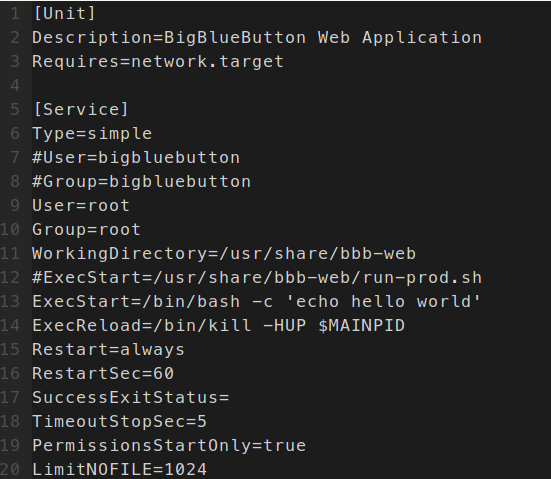

# Privilege Escalation
In BBB versions < 2.2.10 the bbb-web systemd unit is writable by the bigbluebutton user.

This is problematic, since the web services run as the bigbluebutton user.
So if there would be any way to execute code, or write files via a vulnerability, it would be trivial to gain root privileges by 
editing the file `/lib/systemd/system/bbb-web.service`.

This bug could be chained together with the [arbitrary write bug](FileWrite.md) if an attacker manages to place a symlink (e.g. /tmp/hacked.txt) and make it point to the systemd unit file.
A service restart or system reboot would trigger the execution of the attackers code. If done right, this won't leave a noticable trace.
